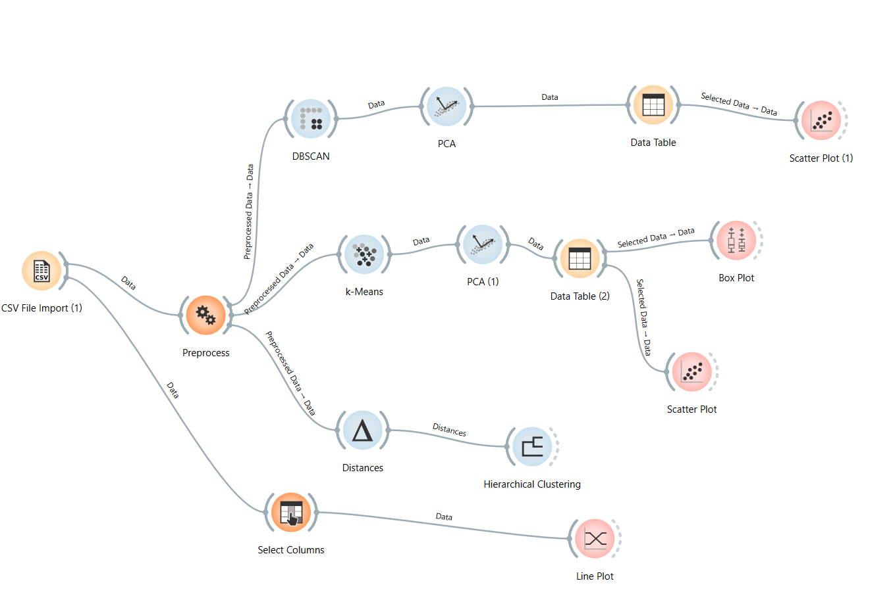

# mba-analysis
Актуальной проблемой для многих студентов бакалавров является выбор университета для поступления в магистратуру на финансовые специальности, доступные по всему миру. Проект выполнен с использованием визуального программирования в среде Orange.

## Реализованная схема

## Результаты
В результате работы у нас получилось выявить три группы кластеров, которые мы самостоятельно определили. Однако в результате исследования определили, что самый высокий рейтинг вузов и престиж их магистратур могут и не влиять на трудоустраиваемость выпускников. Более того, мы выяснили, что скоплений по DBSCAN нет, значит каждая магистратура уникальная, и каждый студент может выбрать университет под свои потребности и необязательно топ 1, ведь поступление в них - большое соревнование! Более того, студент может выбрать по иерархическому дереву группу, подходящую под его способности

## Отчет
Подробный отчет можете загрузить в репозитории:
[Click](./Отчет-1.pdf)
